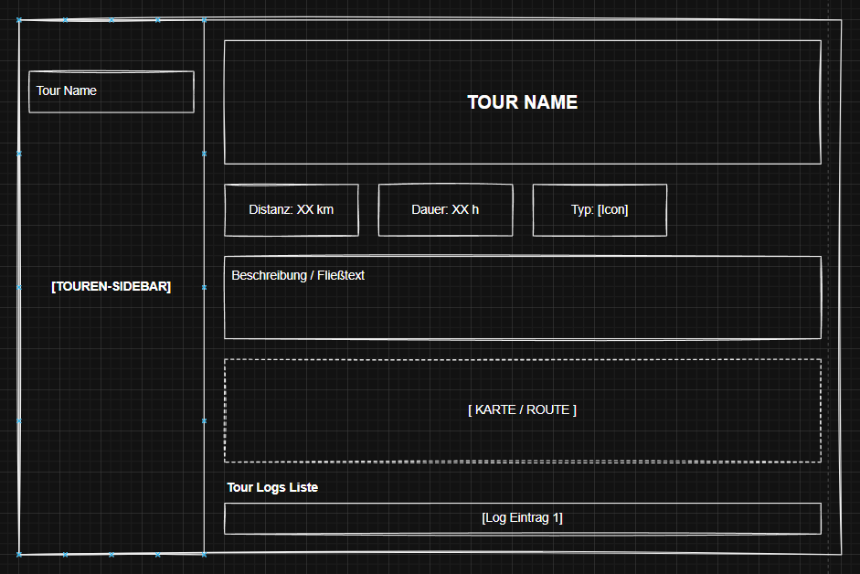
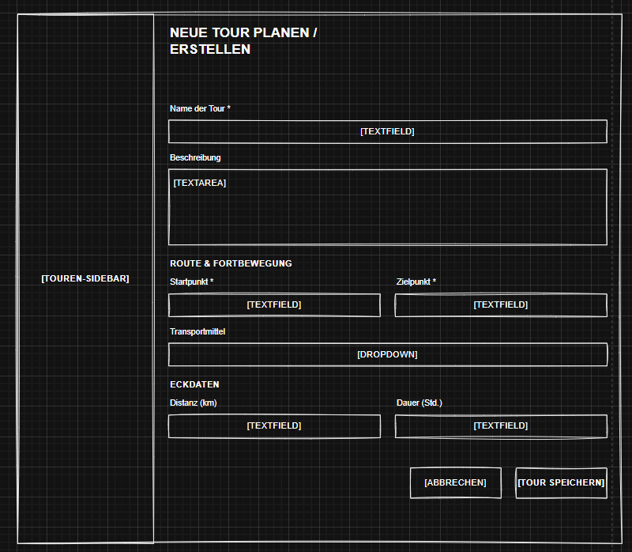
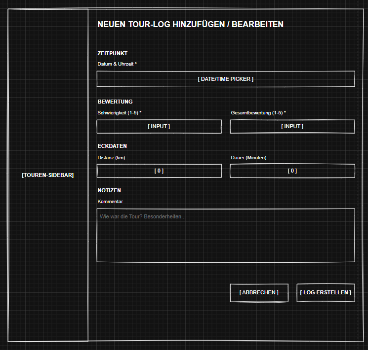

# UX-Beschreibung — Tour Planner

## Layout-Konzept

Die Anwendung folgt einem **Master-Detail-Layout**, aufgeteilt in zwei Bereiche:

- **Linke Seitenleiste:** Eine persistente Tourliste, die immer sichtbar bleibt. Der Benutzer kann Touren durchsuchen und auswählen, ohne den Kontext zu verlieren.
- **Rechter Hauptbereich:** Zeigt die Details der aktuell ausgewählten Tour — inklusive Statistiken, Beschreibung, Kartenplatzhalter und Tourlogs.

Dieses Layout minimiert Navigationsschritte — das Auswählen einer Tour aktualisiert die Detailansicht sofort, ohne Seitenreload oder Routing.

---

## Interaktionsfluss

**Tour erstellen:**
Der Benutzer klickt auf den „+"-Button in der Seitenleiste. Ein **Formular-Overlay** öffnet sich über dem Hauptbereich. Nach dem Speichern erscheint die neue Tour sofort in der Liste und wird automatisch ausgewählt.

**Tour bearbeiten:**
Der Benutzer klickt auf „Bearbeiten" im Detailbereich. Dasselbe Overlay öffnet sich, bereits mit den bestehenden Werten vorausgefüllt. Nach dem Speichern aktualisiert sich die Ansicht sofort.

**Tour löschen:**
Ein Bestätigungsdialog verhindert versehentliches Löschen. Nach der Bestätigung verschwindet die Tour aus der Liste und der Detailbereich wechselt in den leeren Zustand.

**Tourlogs:**
Die Logs werden direkt unterhalb der Karte im Detailbereich angezeigt, immer bezogen auf die aktuell ausgewählte Tour. Der Benutzer kann Logs erstellen, bearbeiten und löschen, ohne den Tourkontext zu verlassen. Alle Änderungen werden sofort in der Liste sichtbar, ohne Seitenreload.

---

## Design-Entscheidungen

| Entscheidung | Begründung |
|---|---|
| Formular-Overlays statt eigener Seiten | Der Benutzer bleibt orientiert — die Tourliste bleibt sichtbar |
| Signals + reaktiver State | UI-Updates passieren sofort, ohne manuelle Refresh-Logik |
| Bestätigungsdialog beim Löschen | Verhindert irreversible Fehlaktionen |
| Logs direkt in der Tourdetailansicht | Logs gehören immer zu einer Tour — keine separate Navigation nötig |
| Responsive Breakpoints (800px, 1200px) | Layout wechselt auf kleineren Bildschirmen von nebeneinander zu untereinander |

---

## Fehlerbehandlung

- Ungültige Formulareingaben werden mit Inline-Fehlermeldungen hervorgehoben (z.B. „Wert muss zwischen 1 und 5 liegen")
- Der Speichern-Button ist deaktiviert solange das Formular ungültig ist
- Backend-Fehler beim Speichern zeigen dem Benutzer eine Fehlermeldung
- Lade- und Fehlerzustände in der Log-Liste geben dem Benutzer Feedback während Daten geladen werden

---

## Wireframes

### Hauptansicht — Master-Detail Layout

### Tour erstellen / bearbeiten

### Tour-Log erstellen / bearbeiten

